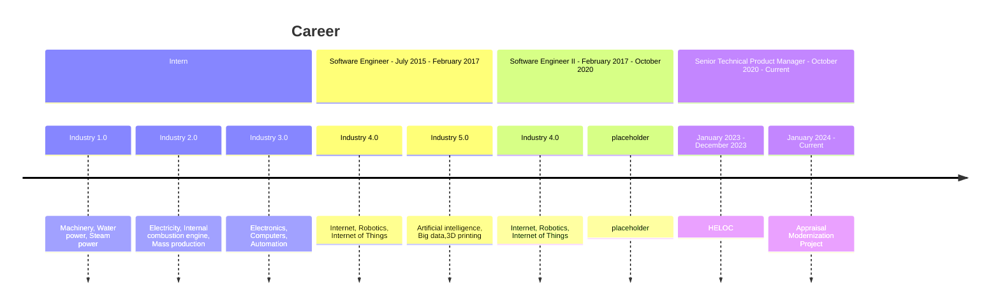

```mermaid
timeline
    title Career
    section Intern
        Industry 1.0 : Machinery, Water power, Steam <br>power
        Industry 2.0 : Electricity, Internal combustion engine, Mass production
        Industry 3.0 : Electronics, Computers, Automation
    section Software Engineer  -     July 2015 - February 2017
        Industry 4.0 : Internet, Robotics, Internet of Things
        Industry 5.0 : Artificial intelligence, Big data,3D printing
    section Software Engineer II  -     February 2017 - October 2020
        Industry 4.0 : Internet, Robotics, Internet of Things
        placeholder : placeholder
    section Senior Technical Product Manager  -     October 2020 - Current
        January 2023 - December 2023 : HELOC
        January 2024 - Current : Appraisal Modernization Project
```